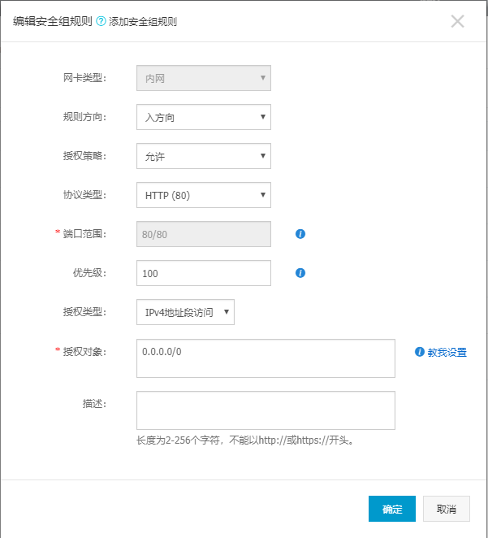

# 工具

[puttygen](https://www.chiark.greenend.org.uk/~sgtatham/putty/latest.html) 处理私钥

[putty](https://www.putty.org/) 远程连接服务器

[WinScp](https://winscp.net/eng/docs/lang:chs) 可视化上传/下载服务器文件

# 常用命令

`netstat -tunlp|grep 端口号` 查看端口是否占用

# nginx安装

* 首先更新apt源`sudo apt-get update` 

* 进行安装 `apt-get install nginx` 

* 启动nginx `nginx` ;停止nginx `nginx -s stop`; 重启 `nginx -s reload`

* 云服务器安全组>配置规则>添加安全组规则：允许访问80端口

  

* 修改nginx配置文件nginx.conf (/etc/nginx/nginx.conf)：

  * 开头user root(修改服务器上的账号root)
  * 修改server
  ```
  server{
		listen 	8080;
		location /harbor {
			alias 	/root/web/output/harbor;
			index	index.html index.htm;
			autoindex on; 
			autoindex_localtime on;
		}
		location /images {
			root 	/root;
			autoindex on;
		}
	}


  ```
  > `listen` 监听端口号

  > `location` url：主机号+端口+/harbor,就会访问location下的配置的文件
  
  > `alis` 访问的绝对路径

  > `root` 访问路径=root+lcoation后的url,如果访问 主机号/images/pic.jpg就是访问/root/images/pic.jpg

  > `autoindex on` 打开目录浏览功能 可以设置location /{ autoindex on }来开启整个虚拟机目录流量

  > `autoindex_localtime on` 显示的文件时间为文件的服务器时间

  * 修改配置后需要重新载入nginx配置 `nginx -s reload`

# 防火墙

* 防火墙打开后sshl无法连接，除非开放端口

  [参考](https://www.cnblogs.com/yuxuan007/p/8043419.html)

  `sudo ufw status` 检查防火墙状态